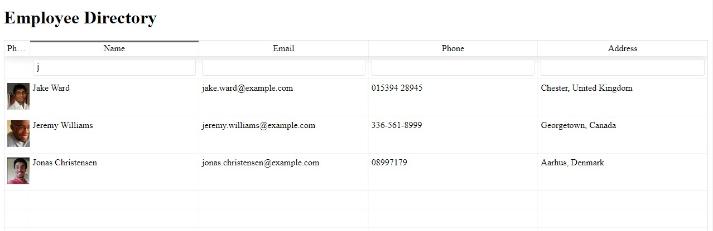

# employeedirectory

Homework19 - Makoto Asahi

Deployed Link:
https://mrasahi.github.io/employeedirectory/

# Description

This is a react app for an employee directory.

The purpose of this app is to demonstrate how employee information can easily be displayed, sorted, and filtered.

Clicking on the header tabs will sort employees by category.

Directly below the header tabs is a search filter, allowing users to easily filter employees.

Managers or employees can greatly benefit from information displayed in a simple and concise format using this app.

# Installation

This app can be run locally by downloading or cloning this repo to your local device.

Once downloaded, run `npm i` from its directory to install all required packages.

Finally, run `npm start` to start the app locally.

# Usage

The current seed data is from the `https://randomuser.me/` API.

Notable technologies used in this app are: `react`, `express`, and `react-table-v6`

